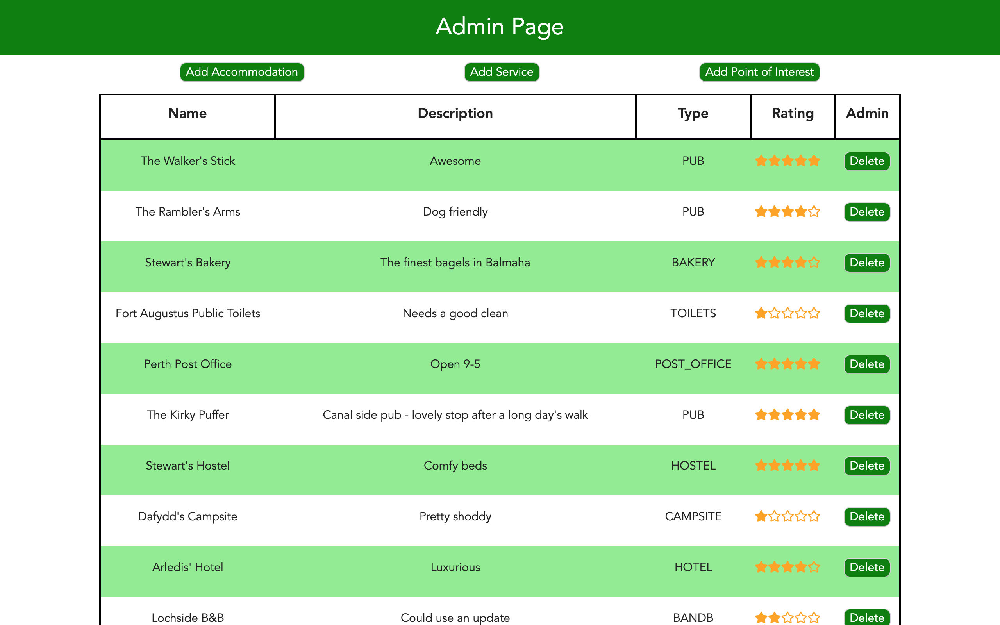

# HikeBuddy

## Plan your hike on the Scottish National Trail - create routes, track your progress and explore points of interest along the trail.

*Full-stack app with a RESTful API build with Java, Spring & Hibernate and a React/JavaScript fronted. Leaflet map interacts with GeoJSON data and a PostgreSQL database.*

*Group project for @CodeClan, built with @craiggough376, @Arledis and @StewartMacLeman*

## Features

* Create hiking routes on an interactive Leaflet map which uses Turf.js to calculate length of section using GeoJSON data

* Add and remove favourite locations to assist planning

* Track route completion progress and view suggested locations

* Points of interest along the trail suggested to user at login

* Administrator can add and remove locations from database

## Screenshots

### Main Page

### Create new route

### Track Routes

### Add and manage favourite locations

### Admin page for location managment

### Admin creating location

